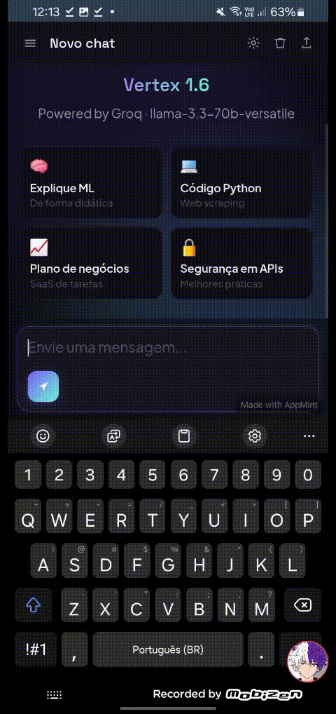
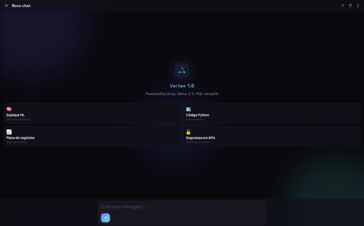
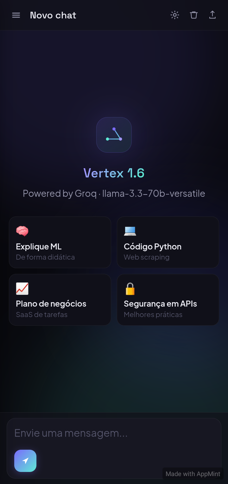

<div align="center">

# 🧠 Vertex AI

### Fast • Intelligent • Modern

Uma inteligência artificial moderna baseada no **Llama 3.3 Versatile**, com inferência de alta velocidade utilizando a **Groq**.

<br>


<br><br>

<a href="https://vertexaiinc.github.io/vertex/index121.html">

</a>

<a href="https://vertexaiinc.github.io/vertex/vertexui.html">

</a>

<a href="https://github.com/VertexAiInc/vertex/raw/refs/heads/main/VertexAi_v1.6.apk">

</a>

</div>

---

# 🎬 Demo

<p align="center">

</p>

---

# 🖥️ Interface

<div align="center">

| Desktop | Mobile |
|:--------:|:-------:|
|  |  |

</div>

---

# ✨ Recursos

- ⚡ Respostas extremamente rápidas
- 🧠 Llama 3.3 Versatile
- 🚀 Powered by Groq
- 🌐 Interface Web moderna
- 📱 Aplicativo Android
- 🌙 Tema escuro
- 💻 Interface otimizada para Desktop
- 📲 Layout responsivo
- 🔒 Conversas privadas
- 🎨 Design limpo e intuitivo

---

# 🚀 Plataformas

| Plataforma | Status |
|------------|:------:|
| 🌐 Web | ✅ |
| 🤖 Android | ✅ |
| 💻 Desktop | ✅ (via navegador) |
| 🍎 iOS | ❌ |

---

# 📊 Informações

| Item | Valor |
|------|-------|
| **Nome** | Vertex AI |
| **Versão** | 1.6 |
| **Modelo** | Llama 3.3 Versatile |
| **Backend** | Groq |
| **Frontend** | HTML, CSS e JavaScript |
| **Plataformas** | Web + Android |

---

# 🛠️ Tecnologias

<div align="center">

| Tecnologia | Uso |
|------------|-----|
| HTML5 | Interface |
| CSS3 | Design |
| JavaScript | Funcionalidades |
| Groq API | Inferência |
| Llama 3.3 Versatile | Modelo de IA |

</div>

---

# 📥 Download

### Android

Baixe a versão mais recente do Vertex AI para Android.

➡️ https://github.com/VertexAiInc/vertex/raw/refs/heads/main/VertexAi_v1.6.apk

---

# 🌐 Acesse

## Página Inicial

https://vertexaiinc.github.io/vertex/index121.html

## Chat

https://vertexaiinc.github.io/vertex/vertexui.html

---

# 📂 Estrutura

```text
vertex/
│
├── img/
│   ├── comp_ui.png
│   ├── mob_ui.png
│   └── ia_text.gif
│
├── index121.html
├── vertexui.html
├── README.md
└── ...
```

---

# 🎯 Objetivo

O **Vertex AI** foi desenvolvido para oferecer uma experiência rápida, moderna e intuitiva, permitindo conversar com um modelo de inteligência artificial de última geração diretamente pelo navegador ou aplicativo Android.

---

# 🔮 Roadmap

- ✅ Interface Web
- ✅ Aplicativo Android
- ✅ Tema escuro
- ✅ Layout responsivo
- 🔄 Histórico de conversas
- 🔄 Melhorias de desempenho
- 🔄 Novas opções de personalização
- 🔄 Atualizações do modelo de IA
- 🔄 Correções e otimizações contínuas

---

# ⭐ Apoie o Projeto

Se o **Vertex AI** foi útil para você, deixe uma **⭐** neste repositório.

Isso ajuda o projeto a alcançar mais pessoas e incentiva futuras atualizações.

---

<div align="center">

## 🧠 Vertex AI

### **Version 1.6**

**Powered by Groq**

**Llama 3.3 Versatile**

Made with ❤️ by **VertexAiInc**

</div>
